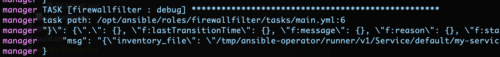
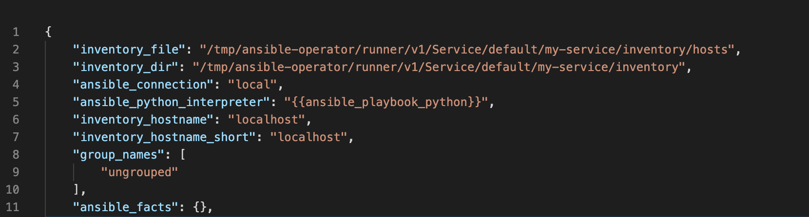

# opnsense-operator

### TODO
- Add finalizers or something to clean up deleted resources
- Add input validation to the FirewallFilter CRD
- Add input validation to the ClusterNodeAlias CRD
- Add a watcher so that we can create and maintain a cluster alias using node labels.

## What this operator supports
### Service Labels
`opnsense.turnbros.app/api-secret` - Required \
The secret name the operator will get the Opnsense API connection information from

`opnsense.turnbros.app/api-secret-namespace` - Optional \
The namespace the `api-secret` is stored in \
**Default:** The namespace of the watched resource

`opnsense.turnbros.app/filter-action` - Optional \
The action to take on matched traffic \
**Options:** `pass`,`block`,`reject` \
**Default:** `pass`

`opnsense.turnbros.app/filter-direction` - Optional \
The direction of the traffic \
**Options:** `in`, `out` \
**Default:** `in`

`opnsense.turnbros.app/filter-interface` - Optional \
The interfaces this rule will be applied to \
**Options:** Depend on your network, typically `lan` or `wan` \
**Default:** `['lan']`

`opnsense.turnbros.app/filter-source-net` - Optional \
The alias, host, or network that traffic will be allowed from\
**Default:** `0.0.0.0 (any)`

`opnsense.turnbros.app/filter-source-port` - Optional \
The ephemeral outbound port to allow source traffic from \
**Options:** Any integer between `0` and `65535` \
**Default:** `0 (any)`

`opnsense.turnbros.app/filter-destination-net` - **Required** \
The destination cluster alias, host, or network

`opnsense.turnbros.app/filter-enable` - Optional \
Controls wether or not this rule is enabled \
**Options:** `true`,`false` \
**Default:** `true`

### Example

#### Create an alias that contains all the cluster nodes
```yaml
apiVersion: opnsense.turnbros.app/v1alpha1
kind: ClusterNodeAlias
metadata:
  name: arroyo-cluster-nodes
spec:
  api_secret_name: opnsense-device-secret
  api_secret_namespace: default
  address_type: ExternalIP
  description: Contains an entry for each node in the cluster.
  enabled: true
  state: present
```

#### Expose a nodeport for a simple minecraft server
```yaml
apiVersion: v1
kind: Service
metadata:
  name: minecraft-service
  labels:
    opnsense.turnbros.app/api-secret: "opnsense-device-secret"
    opnsense.turnbros.app/filter-expose: "true"
    opnsense.turnbros.app/filter-enabled: "true"
    opnsense.turnbros.app/filter-destination-net: "arroyo-cluster-nodes"
spec:
  type: NodePort
  selector:
    app: minecraft-server
  ports:
    - port: 25565
      targetPort: 25565
      protocol: TCP
    - port: 19132
      targetPort: 19132
      protocol: UDP
```

### Custom Resources
#### Firewall Alias Groups
```yaml
apiVersion: opnsense.turnbros.app/v1alpha1
kind: FirewallAlias
metadata:
  name: firewallalias-sample-new
spec:
  api_secret_name: opnsense-device-secret
  api_secret_namespace: default
  description: My second operator alias
  type: port
  enabled: true
  content:
  - "42"
  state: present
```
#### Firewall Filter Rules
```yaml
apiVersion: opnsense.turnbros.app/v1alpha1
kind: FirewallFilter
metadata:
  name: firewallfiltersample
spec:
  api_secret_name: opnsense-device-secret
  api_secret_namespace: default
  action: pass
  direction: in
  interface:
  - wan
  protocol: TCP
  source_net: any
  source_port: 0
  destination_net: Kubernetes_Hosts # This could be the name of a ClusterNodeAlias resource
  destination_port: 32017
  description: Permit internet ingress on port
  enabled: true
  state: present
```

---

### Special Notes For Beginners
#### Debug - Loud and proud
If you're having trouble understanding why you can't get a resource to deploy and need a 
higher log verbosity, simply add the following annotation to the resource you're
trying to deploy: `"ansible.sdk.operatorframework.io/verbosity": "4"`. 

#### Variables - Gotta catch-em-all
If you're new to this and you're struggling to find a way to know what
variables are available to you in a given CRD role, then use this debug command to dump all the available variables
to a string that you can then cleanup via the Python CLI then format and view in VSCode

1. Get the string using this debug task item
```yaml
- name: Dump all the available variables to a string
  debug:
    msg: "{{ vars | to_json }}"
```
2. Copy everything past `manager     "msg":`

3. Remove the escaped double-quotes using the Python CLI. You could do what's outlined below, or you can just paste the string into a PythonCLI and hit enter, it'll fix the escaped characerts
```python
# There are other way to do this, but I find this to be the quickest
tmp = "{\"inventory_file\":...}"
print(tmp)
```
4. Copy the output to VSCode and beautify!
